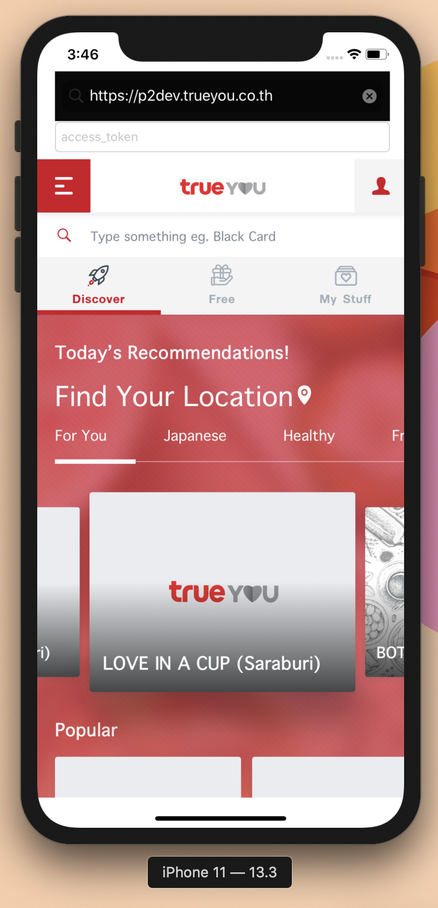

# Webview App

This webview application sends a `POST` request to the specified URL with an access token field as a body parameter.

Default URL points to "https://p2dev.trueyou.co.th/" unless changed inside `ViewController.swift`

## Development

Build and run this project on Xcode. To support installing the test build on an iPhone X or above, you need to install XCode 11 or later.

(Code signing has been disabled)

## More Information

- This app is developed solely for the purpose of helping testers ensure the webview works accordingly.
- For development purposes and not for production use

## Support

Created by Naruth Kongurai.
